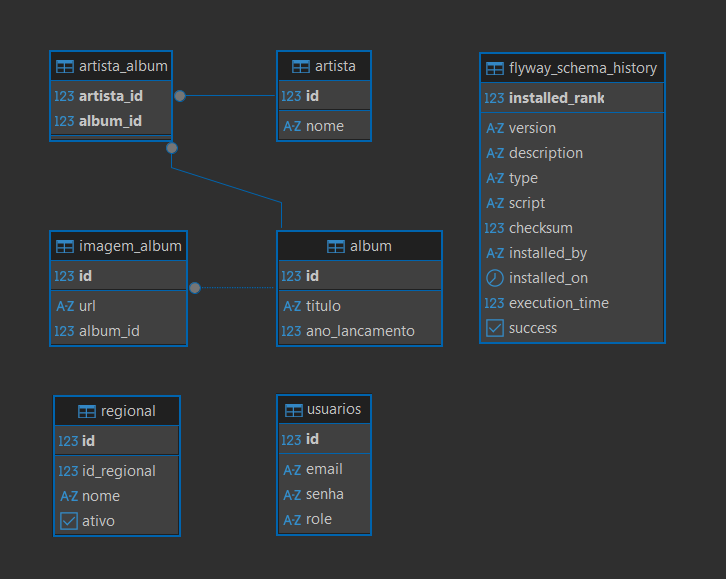
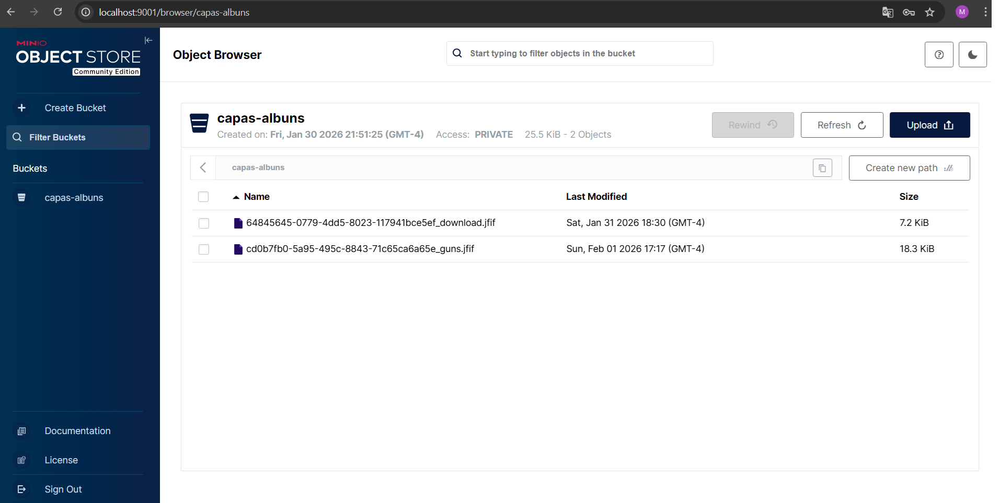
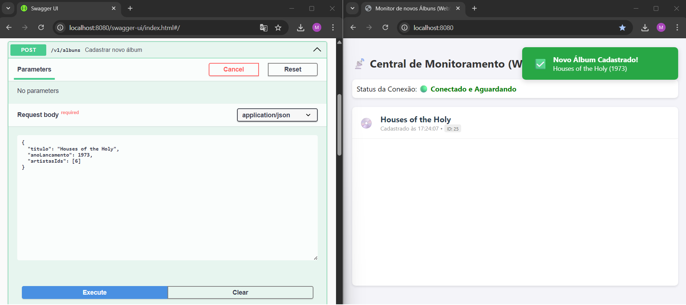

# PROCESSO SELETIVO CONJUNTO Nº 001/2026/SEPLAG e demais Órgãos


## Dados do Processo Seletivo / Vaga
* **Cargo:** Analista de Tecnologia da Informação
* **Perfil:** Engenheiro da Computação (Sênior) 


## Dados do Candidato / Inscrição
* **N° Inscrição :** 16494
* **Nome         :** Milton Pereira da Silva Júnior
* **Email        :** mpsjunior@gmail.com


## Sobre o Projeto
   API REST desenvolvida para gerenciamento de Artistas, Álbuns musicais e integração de Regionais.   
   O projeto foi estruturado para atender requisitos de níveis Sênior, focando em escalabilidade, documentação e boas práticas.


## 🚀 Tecnologias Utilizadas
- **Java 17** (LTS)
- **Spring Boot 3.5.10** (Web, Validation, JPA, WebSocket, Actuator)
- **Maven 3.9.12** (Automatizar build)
- **Git 2.53.0** (Controle de versão do código)
- **PostgreSQL 15** (Banco de Dados Relacional)
- **MinIO** (Servidor Object Storage de alto desempenho).
- **Flyway Migrations** (Versionamento e Migração de Banco de Dados)
- **Docker & Docker Compose** (Orquestração de Ambiente)
- **Bucket4j** (Rate Limiting)
- **Spring Security** (Autenticação e Autorização via Filtros)
- **Auth0 Java-JWT** (Geração e Validação de Tokens)
- **Swagger / OpenAPI** (Documentação e teste dos endpoints da API)


## 📋 Funcionalidades Implementadas

   ### Requisitos Gerais
   - [x] **Segurança**: Bloqueio de acesso a partir de domínios fora do domínio do serviço (Configuração de CORS).
   - [x] **Autenticação JWT**: Implementada com *Spring Security*. Token com expiração de 5 minutos e endpoint de renovação.
   - [x] **CRUD de Artistas**: Ordenação dinâmica e busca por nome.
   - [x] **CRUD de Álbuns**: Paginação, relacionamento N:N com Artistas.
   - [x] **Upload de Imagens**: Suporte a múltiplas capas por álbum, armazenadas no MinIO.
   - [x] **Links Seguros**: Geração de URLs pré-assinadas (Presigned URLs) com expiração de 30 min.
   - [x] **Ambiente Containerizado**: Setup via Docker Compose (API + MinIO + BD).

   ### Requisitos Sênior
   - [x] **Health Checks e Liveness/Readiness**: Implementados via *Spring Actuator*. A API expõe endpoints nativos de Liveness e Readiness.
   - [x] **Testes unitários**: Implementa uma suíte de testes unitários utilizando *JUnit 5* e *Mockito*.
   - [x] **WebSockets**: Notificação em tempo real ao cadastrar novos álbuns (`/v1/albuns`) e painel de monitoramento visual.
   - [x] **Rate Limiting**: Limita requisições por IP (10 requisições/minuto), garantindo que a infraestrutura não seja sobrecarregada por acessos excessivos e segurança contra ataques de força bruta.
   - [x] **Endpoint de Regionais**: Integração com API externa, implementando lógica de versionamento (Inativar antigo vs Criar novo) para manter histórico.


## 🏗️ Decisões Arquiteturais
1. **Estrutura de Banco de Dados:**
   - IDs autoincrementais (`bigserial`).
   - Adotado relacionamento N:N entre `Artista` e `Álbum`. Criada tabela `artista_album` para fazer o relacionamento.
   - Criada tabela `imagem_album` para salvar o vinculo entre um álbum e suas várias capas salvas no MinIO.
   - Utilização do **Flyway Migrations** para versionamento de schema e carga inicial de dados de exemplo (artistas e álbuns).
   - **Versionamento de Regionais**: A tabela `regional` utiliza um ID interno (id) diferente do ID externo (id_regional). 
      Isso permite que, se uma regional mudar de nome no Endpoint, a API inativa o registro antigo e cria um novo, 
      mantendo a integridade referencial histórica.
   
2. **Segurança e Performance**
   - Implementado filtro de **Rate Limit** (10 requisições/min) via Bucket4j, para garantir segurança e disponibilidade do serviço.
   - Criada Whitelist de prefixos que não consomem tokens do bucket para permitir acesso irrestrito à documentação e arquivos estáticos.
   - Para evitar possíveis erros ou bloqueios durante os testes, toda a parte de autenticação e segurança foi propositalmente implementada no final do projeto.

3. **Health Checks:**
   - A responsabilidade de reportar a saúde da aplicação foi migrada do docker-compose para o *Spring Actuator*.


## 📸 Screenshots

### 1. Modelagem de Dados
Estrutura relacional do banco de dados (PostgreSQL).  


### 2. Armazenamento de capas (MinIO)
As capas dos álbuns são armazenadas em buckets no MinIO.  


### 3. Monitoramento em Tempo Real (WebSocket)
A API notifica todos os clientes conectados quando um novo álbum é cadastrado.  



---


## 🛠️ Como Executar o Projeto

### Pré-requisitos (Instalar e configurar)
- **JDK 17** (https://jdk.java.net/archive/)  
- **Docker** (https://www.docker.com/products/docker-desktop/)  
- **Git** (https://git-scm.com/install/windows)  
- **Maven 3.9.12** (https://dlcdn.apache.org/maven/maven-3/3.9.12/binaries/)
   > **Nota:** Como o projeto é containerizado, não é obrigatório ter Java/Maven instalados apenas para rodar a aplicação, mas é recomendado para execução de testes unitários.
   > **Portas Livres:** Certifique-se de que não há nada rodando nas portas **8080**, **5432** e **9000**.  

### Passo 1: Clonar o repositório Git
- No terminal do Docker, execute:  
```bash
git clone https://github.com/mpsjr/miltonpereiradasilvajunior983420.git
cd miltonpereiradasilvajunior983420
```  

### Passo 2: Subir Infraestrutura (Banco e MinIO)
- No terminal, na raiz do projeto, execute:  
   `docker-compose up -d --build`

   > **Nota:** Isso iniciará o PostgreSQL (Porta 5432), o MinIO (Porta 9000/9001) e a API (Porta 8080).  
   > A API iniciará na porta 8080. O Flyway criará as tabelas e fará a carga inicial de dados automaticamente.  


---


## 🩺 Monitoramento (Health Checks)
A aplicação expõe endpoints de diagnóstico padronizados para orquestradores:

| **Geral** (`http://localhost:8080/actuator/health`) : Status Geral. Resumo agregado de todos os componentes.  
| **Liveness** (`http://localhost:8080/actuator/health/liveness`) : Monitora se o processo Java está rodando e não travou.  
| **Readiness** (`http://localhost:8080/actuator/health/readiness`) : Monitora se a API consegue se conectar com *PostgreSQL* e *MinIO*.  


---


## 📚 Documentação e testes da API (Swagger)
Acesse a interface do Swagger para testar todos os endpoints de forma interativa:  
👉 **[http://localhost:8080/swagger-ui.html](http://localhost:8080/swagger-ui.html)**

### 🔐 Guia de Autenticação
A API segue o padrão **Stateless** via Token JWT. Os endpoints são protegidos e exigem um token válido no cabeçalho `Authorization`.

#### 1. Credenciais de Acesso (Admin).
   O **Flyway** cria automaticamente um usuário administrador na inicialização do banco:
   * **Email:** `admin@seplag.mt.gov.br`
   * **Senha:** `123`

#### 2. Como se autenticar no Swagger.
Para facilitar os testes, o Swagger foi configurado com suporte a Security Schemes:

   1. Acesse o endpoint `POST /auth/login`.
   2. Clique em **Try it out** e insira as credenciais acima no JSON.
   3. Execute e copie o `token` retornado na resposta (sem as aspas).
   4. Suba ao topo da página do Swagger e clique no botão verde **🔓 Authorize**.
   5. Cole o token no campo **Value** e clique em **Authorize**.
   6. Pronto! Os cadeados ao lado dos endpoints ficarão fechados (🔒) e você terá acesso liberado por **5 minutos**.

      > **Nota:** Se o token expirar, utilize o endpoint `POST /auth/refresh` (estando logado) para obter um novo, ou faça login novamente.  


### 🎤 Artistas - Gerenciamento de cantores e bandas

- **Busca artista por Id** - Permite consultar um artista informando o seu Id.  
  `GET /v1/artistas/{id}`  

- **Listar artistas** - Permite buscar artistas por nome (opcional) com ordenação alfabética (asc/desc).  
  `GET /v1/artistas`  
         
- **Atualizar artista existente** - Permite atualizar dados do artista.  
  `PUT /v1/artistas/{id}`  
      
- **Cadastrar novo artista** - Permite cadastrar os dados de um novo artista.  
  `POST /v1/artistas`


### 💿 Álbuns - Gerenciamento de Discos/Álbuns e relação com Artistas.
   
- **Busca álbum por Id** - Permite consultar um álbum informando o seu Id.  
  `GET /v1/albuns/{id}`  

- **Listar Álbuns (Paginado)** - Permite consultar álbuns por artista (cantor/banda), ordenar a busca por um campo (sort), paginar a busca (page/size).  
  `GET /v1/albuns`  
      
- **Atualizar Álbum** - Permite atualizar as informações de um álbum existente.  
  `PUT /v1/albuns/{id}`  
   
- **Cadastrar novo Álbum** - Permite cadastrar um novo álbum e vincular a um artista.  
  `POST /v1/albuns`  

- 📡 **Monitor WebSocket** - Permite testar o monitoramento em tempo real ao cadastrar um novo álbum.  
   1 . Antes de cadastrar um novo álbum, abra o navegador em: [http://localhost:8080/index.html](http://localhost:8080/index.html) (Painel de Monitoramento).  
   2 . Verifique se o status inicial é "Conectado".  
   3 . Mantenha essa aba visível ou em uma janela separada lado-a-lado.  
   4 . Efetue o cadastro de um novo álbum em `POST /v1/albuns`. 

- **Upload de capa do Álbum** - Permite fazer o upload de imagens que serão as capas do Álbum. A imagem é enviada para o MinIO.  
  `POST /v1/albuns/{id}/capa`  


### 🗺️ Regionais - Sincronização com API externa.

- **Listar Regionais ativas** - Permite consultar as Regionais que estão ativas.  
  `GET /v1/regionais`  

  > **Resultado:** Ao executar a consulta antes da sincronização, irá mostrar uma lista vazia.  

- **Disparar Sincronização** - Acessa a API externa e busca dados para atualizar a base de dados local.  
  `POST /v1/regionais/sincronizacao`  

  > **Resultado:** Ao finalizar a sincronização, a API informa o resultado com o número de regionais inseridas, atualizadas e inativadas.  


### 🚦 Rate Limit - Controle de requisições que um usuário pode fazer.

- **Testar Rate Limit**  
   1 . Em qualquer endpoint (ex: `GET /v1/artistas`).    
   2 . Clique em "Execute" rapidamente (mais de 10 vezes em 1 minuto).    
   3 . Você receberá um erro HTTP 429 com a seguinte mensagem: *Limite de requisições excedido (10 req/min). Aguarde um momento.*    


---


## 🛡️ Testes Automatizados
O projeto implementa uma suíte de testes unitários utilizando **JUnit 5** e **Mockito**.  
A execução valida a integridade das regras de negócio críticas antes de qualquer deploy.

### 🧠 Estratégia de Testes
Os testes concentram-se nos 3 serviços principais:  

- **`ArtistaServiceTest`:**
   * **O que valida:** Garante que o fluxo básico de cadastro e manipulação de entidades e DTOs está operando corretamente.

- **`AlbumServiceTest`:**
   * **O que valida:** Garante que, ao salvar um álbum, a API não apenas persista no banco, mas também dispare o evento de notificação em tempo real.

- **`RegionalServiceTest`:**
    * **O que valida:** Garante que o algoritmo de *versionamento* funcione: detectar mudanças de nome, inativar o registro antigo (preservando histórico) e criar o novo registro automaticamente.

   > **Decisão Arquitetural:** DTOs simples, configurações de framework e outros métodos foram excluídos da cobertura para priorizar os serviços principais da API.  


### ⚙️ Como Executar os Testes Automatizados
- No terminal, na raiz do projeto, execute um dos comando abaixo:  
   `mvn test` ou `mvn clean test`

   > **Nota:** O Maven irá compilar o projeto e executar todos os testes automatizados, localizados em: *src/test/java/br/gov/mt/seplag/lista_api/service*  


📄 **Resultado Esperado:**  
   Após a execução, serão exibidos logs personalizados para facilitar o acompanhamento:  
   > Teste de Cadastro de Álbum: SUCESSO. Álbum ID 50 salvo e notificação WebSocket enviada.  
   > Teste de Cadastro de Artista: SUCESSO.  
   > Teste de Versionamento de Regionais: SUCESSO. Sincronização concluída. Inseridos: 0, Atualizados: 1, Inativados: 0  
   > BUILD SUCCESS  
